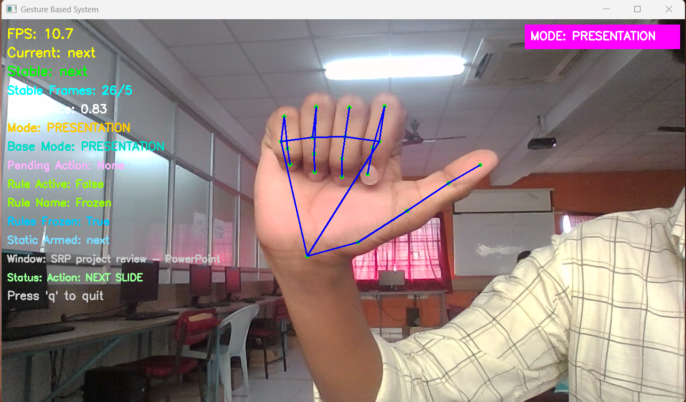
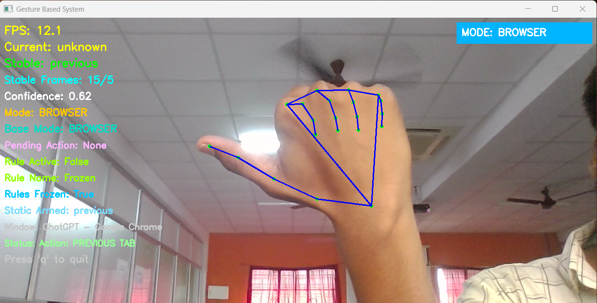
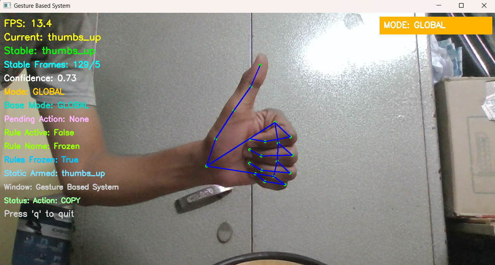
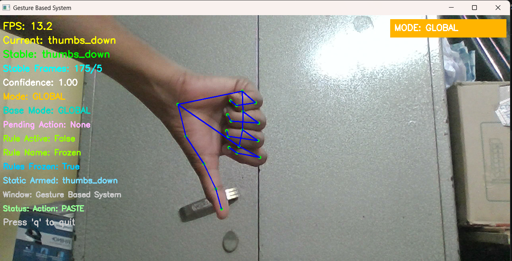
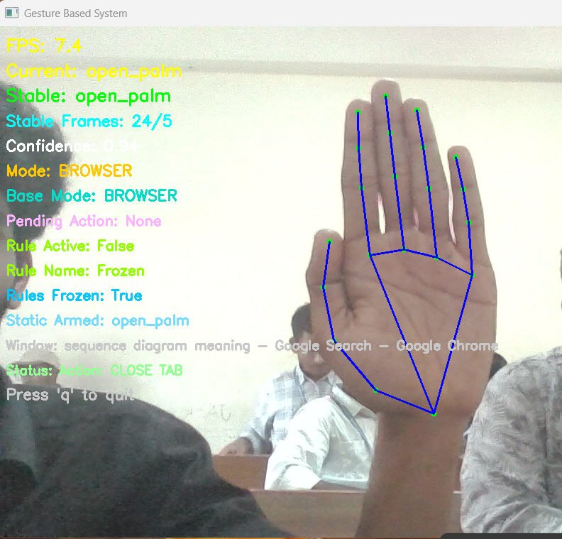
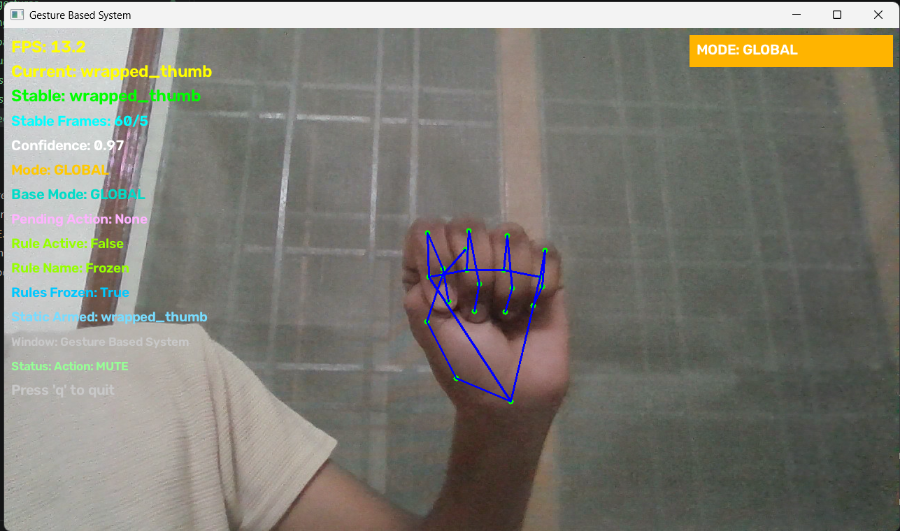
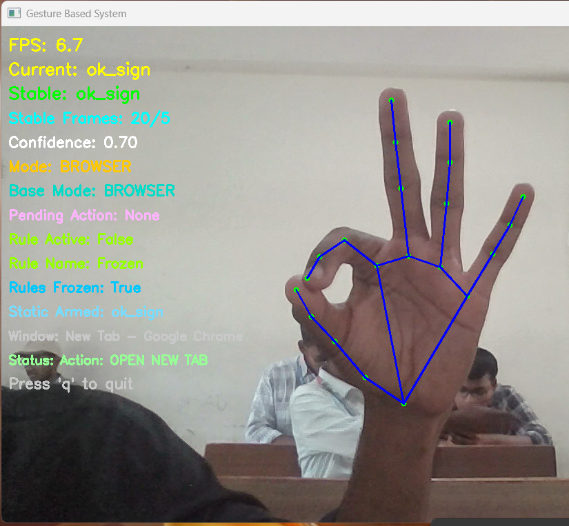
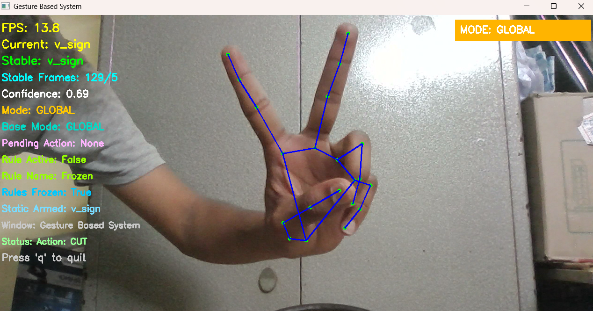
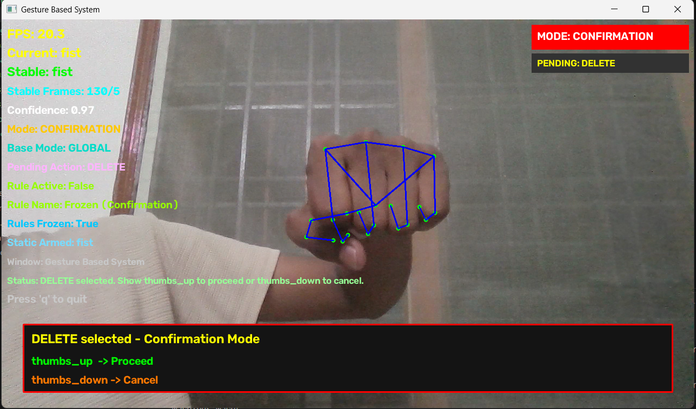

# 🖐️ Gesture Based System Control

> A real-time, webcam-based computer control system that transforms hand gestures into mouse, keyboard, browser, and presentation actions.

[](https://www.python.org/)
[](https://opencv.org/)
[](https://ai.google.dev/edge/mediapipe/solutions/guide)
[](https://scikit-learn.org/)

---

## 📑 Table of Contents

- [Overview](#overview)
- [Key Features](#key-features)
- [How It Works](#how-it-works)
- [Gesture Controls](#gesture-controls)
  - [Continuous Controls](#continuous-controls)
  - [Static Gesture Commands](#static-gesture-commands)
- [Application Modes](#application-modes)
  - [Global Mode](#global-mode)
  - [Browser Mode](#browser-mode)
  - [Presentation Mode](#presentation-mode)
- [Gesture-to-Action Mapping](#gesture-to-action-mapping)
- [System Architecture](#system-architecture)
- [Why Rule-Based + Machine Learning?](#why-rule-based--machine-learning)
- [Technology Stack](#technology-stack)
- [Project Structure](#project-structure)
- [Requirements](#requirements)
- [Installation & Setup](#installation--setup)
- [Quick Start](#quick-start)
- [Using the Application](#using-the-application)
- [Safety & Reliability Mechanisms](#safety--reliability-mechanisms)
- [Design Principle](#design-principle)
- [Limitations](#limitations)
- [Future Scope](#future-scope)
- [Contributing](#contributing)
- [License](#license)

---

# 🧠 Overview

**Gesture Based System Control** is a computer-vision application that enables users to interact with a Windows computer using hand gestures captured through a webcam.

Instead of relying entirely on a physical mouse and keyboard, the system detects the user's hand, extracts its **21 landmark points**, interprets the hand configuration, and converts recognized gestures into computer actions.

The application combines two complementary recognition techniques:

* **Rule-based recognition** for continuous interactions such as cursor movement, clicking, dragging, and scrolling.
* **Machine-learning-based recognition** for intentional static gestures such as copy, paste, cut, delete, mute, and application-specific commands.

The system also uses **application-aware control modes**, allowing the same gesture to perform different actions depending on the currently active application.

### Core Concept

```text
Hand Gesture + Application Context → Computer Action
```

The project follows a simple philosophy:

> **Fewer gestures, more actions.**

---

# ✨ Key Features

### 🖐️ Real-Time Hand Tracking

* Captures hand input directly through a webcam.
* Detects and tracks **21 hand landmarks** using MediaPipe.
* Processes gestures in real time.

### 🖱️ Touchless Mouse Control

* Move the cursor using hand movement.
* Perform left-click and right-click operations.
* Perform double-click actions.
* Select and drag objects using gestures.
* Scroll through content using hand gestures.

### 🤖 Static Gesture Recognition

* Uses a trained **Random Forest classifier** for static gesture recognition.
* Requires gestures to remain stable before triggering commands.
* Uses prediction confidence to improve reliability.

### 🧩 Application-Aware Controls

The application detects the active window and automatically switches its interaction mode.

Supported contexts include:

* **Global Mode**
* **Browser Mode**
* **Presentation Mode**

### 🔄 Release-to-Rearm

After a static gesture executes an action, the system waits for the gesture to be released before allowing the same command to execute again.

This prevents repeated actions while a gesture is being held.

### 🎯 Context-Specific Actions

The same gesture can have different meanings depending on the active application.

For example:

```text
Next Gesture
      ↓
Browser      → Next Tab
PowerPoint   → Next Slide
```

---

# 🎯 Gesture Reference

The application uses a compact set of hand gestures to control different computer operations.

A gesture can have a **different meaning depending on the active application**. The following reference shows the gestures supported by the system and the actions associated with them.

## Gesture-to-Action Matrix

| Gesture           | Visual                                                    | Global Mode | Browser Mode                  | Presentation Mode   |
| ----------------- | --------------------------------------------------------- | ----------- | ----------------------------- | ------------------- |
| **Next**          |           | —           | **Next Tab**                  | **Next Slide**      |
| **Previous**      |       | —           | **Previous Tab**              | **Previous Slide**  |
| **Thumbs Up**     |      | **Copy**    | **Copy**                      | **Copy**            |
| **Thumbs Down**   |    | **Paste**   | **Paste**                     | **Paste**           |
| **Open Palm**     |      | —           | **Close Tab**                 | **End Slideshow**   |
| **Wrapped Thumb** |  | **Mute**    | **Mute**                      | **Mute**            |
| **OK Sign**       |        | —           | **Open New Tab**              | **Start Slideshow** |
| **V Sign**        |         | **Cut**     | **Cut / YouTube Play-Pause*** | **Cut**             |
| **Fist**          |           | **Delete**  | **Delete**                    | **Delete**          |

> ***** The V Sign triggers **YouTube Play/Pause** only when the active browser window and page satisfy the application's YouTube-specific condition.

---

## 🔀 Context-Aware Gesture Behavior

The same physical gesture can produce different actions depending on the active application.

### Example 1 — Next Gesture

```text
👉 Next Gesture
       │
       ├── Browser Mode
       │      └── Next Browser Tab
       │
       └── Presentation Mode
              └── Next PowerPoint Slide
```

### Example 2 — OK Sign

```text
👌 OK Sign
      │
      ├── Browser Mode
      │      └── Open New Tab
      │
      └── Presentation Mode
             └── Start Slideshow
```

### Example 3 — Open Palm

```text
✋ Open Palm
      │
      ├── Browser Mode
      │      └── Close Current Tab
      │
      └── Presentation Mode
             └── End Slideshow
```

This context-aware design allows the system to provide more functionality without requiring a large number of different gestures.

---

## 🖱️ Continuous Mouse Gestures

In addition to the static gestures shown above, the application uses rule-based hand interactions for continuous mouse control.

| Hand Interaction           | Action           |
| -------------------------- | ---------------- |
| **Index + Middle Fingers** | Move Cursor      |
| **Index Finger + Thumb**   | Left Click       |
| **Middle Finger + Thumb**  | Right Click      |
| **Index + Thumb Tap**      | Double Click     |
| **Index + Thumb Hold**     | Select / Drag    |
| **Scroll Gesture**         | Scroll Up / Down |

These interactions are handled by the **rule-based controller** because mouse operations require continuous, low-latency responses.

---

## 🧠 Gesture Recognition Categories

The gestures are processed using two complementary mechanisms:

### Rule-Based Gestures

Used for continuous interactions:

```text
Cursor Movement
     ↓
Left Click
     ↓
Right Click
     ↓
Double Click
     ↓
Drag / Select
     ↓
Scrolling
```

### Static ML Gestures

Used for intentional commands:

```text
Thumbs Up       → Copy
Thumbs Down     → Paste
V Sign          → Cut
Fist            → Delete
Wrapped Thumb   → Mute
Next            → Context-specific Navigation
Previous        → Context-specific Navigation
OK Sign         → Context-specific Action
Open Palm       → Context-specific Action
```

The ML-based gestures require a stable pose before an action is triggered, while continuous mouse interactions are handled directly by the rule-based controller.

---

# ⚙️ How It Works

The application processes the user's hand input through the following pipeline:

```text
Webcam
   ↓
OpenCV Frame Capture
   ↓
MediaPipe Hand Tracking
   ↓
21 Hand Landmarks
   ↓
Feature Processing
   ↓
┌──────────────────────────────┐
│                              │
│  Rule-Based Controller       │
│          +                   │
│  Static ML Predictor         │
│                              │
└──────────────┬───────────────┘
               ↓
        Active Application
               ↓
          Control Mode
               ↓
         Action Mapping
               ↓
     PyAutoGUI / Window Control
               ↓
        Computer Action
```

### Processing Flow

1. The webcam continuously captures video frames.
2. OpenCV processes the incoming frames.
3. MediaPipe detects the user's hand.
4. The 21 hand landmarks are extracted.
5. Landmark coordinates are converted into useful geometric features.
6. The rule-based controller handles continuous interactions.
7. Stable static gestures are passed to the ML classifier.
8. The active application determines the current control mode.
9. The recognized gesture is mapped to the appropriate action.
10. PyAutoGUI and Windows automation libraries execute the action.

---

# 🖐️ Gesture Controls

The application divides gesture interaction into two categories.

## Continuous Controls

Continuous interactions are handled using predefined geometric relationships between hand landmarks.

| Gesture                | Action             |
| ---------------------- | ------------------ |
| Index + Middle Finger  | Cursor movement    |
| Index + Thumb          | Left Click         |
| Middle + Thumb         | Right Click        |
| Repeated Index + Thumb | Double Click       |
| Hold Index + Thumb     | Drag / Select      |
| Scroll Gesture         | Vertical Scrolling |

These controls are handled primarily through rules because continuous actions require fast and predictable responses.

---

## Static Gesture Commands

Static gestures are recognized by the trained machine-learning model after the gesture remains stable for the required number of frames.

| Gesture         | Command                  |
| --------------- | ------------------------ |
| 👍 Thumbs Up    | Copy                     |
| 👎 Thumbs Down  | Paste                    |
| ✌️ V Sign       | Cut                      |
| 👊 Fist         | Delete with Confirmation |
| ✊ Wrapped Thumb | Mute                     |

The exact interpretation of some gestures can change according to the active application mode.

---

# 🎛️ Application Modes

The system automatically determines the control mode based on the currently active application.

---

## Global Mode

Global Mode provides general-purpose computer controls.

| Gesture         | Action |
| --------------- | ------ |
| 👍 Thumbs Up    | Copy   |
| 👎 Thumbs Down  | Paste  |
| ✌️ V Sign       | Cut    |
| 👊 Fist         | Delete |
| ✊ Wrapped Thumb | Mute   |

These commands are intended to work across normal desktop applications.

---

## Browser Mode

When a supported browser is active, the system switches to **Browser Mode**.

Supported browsers include:

* Google Chrome
* Microsoft Edge
* Mozilla Firefox
* Brave

Browser-specific commands include:

| Gesture   | Action                    |
| --------- | ------------------------- |
| Next      | Next Tab                  |
| Previous  | Previous Tab              |
| OK Sign   | Open New Tab              |
| Open Palm | Close Current Tab         |
| V Sign    | Cut / YouTube Play-Pause* |

* The YouTube-specific action is triggered only when the active browser satisfies the application's YouTube detection condition.

---

## Presentation Mode

When Microsoft PowerPoint is the active application, the system switches to **Presentation Mode**.

| Gesture   | Action          |
| --------- | --------------- |
| Next      | Next Slide      |
| Previous  | Previous Slide  |
| OK Sign   | Start Slideshow |
| Open Palm | End Slideshow   |

This allows basic presentation navigation without directly interacting with the keyboard or mouse.

---

# 🔄 Gesture-to-Action Mapping

The important design feature is that a recognized gesture is **not necessarily tied to one fixed action**.

The system separates:

```text
Gesture Recognition
        ↓
Application / Mode Detection
        ↓
Action Mapping
        ↓
Computer Operation
```

For example:

| Gesture        | Global | Browser                   | Presentation    |
| -------------- | ------ | ------------------------- | --------------- |
| 👍 Thumbs Up   | Copy   | Copy                      | Copy            |
| 👎 Thumbs Down | Paste  | Paste                     | Paste           |
| ✌️ V Sign      | Cut    | Cut / YouTube Play-Pause* | Cut             |
| Next           | —      | Next Tab                  | Next Slide      |
| Previous       | —      | Previous Tab              | Previous Slide  |
| 👌 OK Sign     | —      | New Tab                   | Start Slideshow |
| ✋ Open Palm    | —      | Close Tab                 | End Slideshow   |

This separation makes the application easier to extend because new actions or application modes can be added without redesigning the underlying hand-detection pipeline.

---

# 🏗️ System Architecture

```text
                       ┌──────────────┐
                       │    Webcam    │
                       └──────┬───────┘
                              ↓
                       ┌──────────────┐
                       │    OpenCV    │
                       └──────┬───────┘
                              ↓
                    ┌────────────────────┐
                    │  MediaPipe Hands   │
                    │  21 Landmarks      │
                    └─────────┬──────────┘
                              ↓
                    ┌────────────────────┐
                    │ Feature Processing │
                    └─────────┬──────────┘
                              ↓
              ┌───────────────┴───────────────┐
              ↓                               ↓
    ┌────────────────────┐          ┌──────────────────┐
    │ Rule-Based         │          │ ML Predictor     │
    │ Controller         │          │ Random Forest    │
    └─────────┬──────────┘          └────────┬─────────┘
              │                              │
              └──────────────┬───────────────┘
                             ↓
                   ┌───────────────────┐
                   │ Active Application│
                   │ / Control Mode    │
                   └─────────┬─────────┘
                             ↓
                   ┌───────────────────┐
                   │   Action Mapping  │
                   └─────────┬─────────┘
                             ↓
              ┌────────────────────────────┐
              │ PyAutoGUI / Window Control│
              └──────────────┬─────────────┘
                             ↓
                    ┌────────────────┐
                    │ Computer Action │
                    └────────────────┘
```

---

# 🧩 Why Rule-Based + Machine Learning?

The project intentionally combines both approaches because continuous and static interactions have different requirements.

### Rule-Based Recognition

Best suited for:

* Cursor movement
* Clicking
* Dragging
* Scrolling
* Other continuous interactions

Rules provide fast and predictable responses for these operations.

### Machine Learning Recognition

Best suited for:

* Static hand poses
* Intentional commands
* Application-specific commands
* Commands that should trigger only after a gesture is held steadily

The combination provides a wider range of controls without requiring a separate gesture for every computer operation.

---

# 🛠️ Technology Stack

| Technology          | Role                                          |
| ------------------- | --------------------------------------------- |
| **Python**          | Core application and control logic            |
| **OpenCV**          | Webcam capture and real-time image processing |
| **MediaPipe Hands** | Hand detection and 21-landmark tracking       |
| **NumPy**           | Numerical calculations and feature processing |
| **Pandas**          | Dataset handling and preprocessing            |
| **Scikit-learn**    | Random Forest model training and prediction   |
| **Joblib**          | Saving and loading the trained ML model       |
| **PyAutoGUI**       | Mouse, keyboard, and system automation        |
| **PyGetWindow**     | Active-window detection                       |
| **Pywinauto**       | Windows application interaction               |

---

# 📁 Project Structure

```text
gesture_command/
│
├── data/
│   └── gestures_dataset.csv
│
├── models/
│   ├── gesture_model_final_1.pkl
│   └── hand_landmarker.task
│
├── src/
│   ├── controls/
│   │   ├── gesture_actions.py
│   │   └── rule_controller.py
│   │
│   ├── ml/
│   │   └── live_predictor.py
│   │
│   ├── preprocessing/
│   │   └── feature_utils.py
│   │
│   ├── utils/
│   │   └── drawing_utils.py
│   │
│   └── main.py
│
├── collection_script.py
├── train_model.py
├── requirements.txt
├── .gitignore
└── README.md
```

### Important Components

**`src/main.py`**
Main entry point of the application.

**`src/controls/rule_controller.py`**
Handles real-time rule-based gestures and continuous mouse interactions.

**`src/controls/gesture_actions.py`**
Contains gesture-to-action mappings and computer-control operations.

**`src/ml/live_predictor.py`**
Loads the trained model and performs live static gesture prediction.

**`src/preprocessing/feature_utils.py`**
Processes landmark data into model-compatible features.

**`src/utils/drawing_utils.py`**
Handles visual overlays and hand-tracking display utilities.

**`train_model.py`**
Trains the static gesture classification model.

**`collection_script.py`**
Used to collect gesture samples for dataset creation.

---

# 💻 Requirements

Before installing the project, make sure the system has:

* Windows 10 or Windows 11
* Python 3.10 or later
* Git
* A working webcam
* Internet connection for installing Python dependencies

Check the installed versions:

```powershell
python --version
git --version
```

---

# 🚀 Installation & Setup

## 1. Clone the Repository

Clone the project repository and enter the project directory:

```powershell
git clone <REPOSITORY_URL>
cd gesture_command
```

---

## 2. Create a Virtual Environment

Creating a virtual environment keeps project dependencies isolated from other Python projects.

```powershell
python -m venv .venv
```

---

## 3. Activate the Virtual Environment

For PowerShell:

```powershell
.\.venv\Scripts\Activate.ps1
```

If PowerShell blocks script execution, run:

```powershell
Set-ExecutionPolicy -Scope Process -ExecutionPolicy Bypass
```

Then activate the environment again:

```powershell
.\.venv\Scripts\Activate.ps1
```

You should now see:

```text
(.venv)
```

at the beginning of the terminal prompt.

---

## 4. Install Dependencies

Upgrade pip:

```powershell
python -m pip install --upgrade pip
```

Install the project dependencies:

```powershell
pip install -r requirements.txt
```

---

# ⚡ Quick Start

Once the dependencies are installed, the application can be started directly.

```powershell
.\.venv\Scripts\Activate.ps1
python src\main.py
```

The application will:

```text
Start Webcam
      ↓
Detect Hand
      ↓
Track 21 Landmarks
      ↓
Recognize Gestures
      ↓
Detect Active Application
      ↓
Execute Corresponding Action
```

The trained gesture model and MediaPipe hand-landmarker file are already included in the repository, so **model training is not required for normal usage**.

---

# 🎮 Using the Application

After starting the application:

### 1. Allow Webcam Access

Make sure the application has permission to access your webcam.

### 2. Position Your Hand

Keep your hand clearly visible within the camera frame.

### 3. Use Continuous Gestures

Use the rule-based gestures for:

* Cursor movement
* Left click
* Right click
* Double click
* Dragging
* Scrolling

### 4. Hold Static Gestures

For ML-based commands, hold the desired gesture steadily until the application recognizes it.

### 5. Release Before Repeating

After a static command executes, release the gesture before performing the same command again.

### 6. Switch Applications

The system detects the active application and automatically changes the applicable control mode.

For example:

```text
Normal Desktop
      ↓
Global Mode

Chrome / Edge / Firefox / Brave
      ↓
Browser Mode

Microsoft PowerPoint
      ↓
Presentation Mode
```

---

# 🛡️ Safety & Reliability Mechanisms

Because computer-control applications can accidentally trigger unwanted actions, the system includes several mechanisms to improve reliability.

### Gesture Stability

Static gestures must remain stable for a specified number of frames before they are considered valid.

### Confidence Filtering

The ML prediction is evaluated using its confidence before an action is executed.

### Release-to-Rearm

A recognized static gesture cannot repeatedly trigger the same action while continuously held.

```text
Gesture Detected
      ↓
Stable?
   No → Continue Tracking
   Yes
      ↓
ML Prediction
      ↓
Confidence Check
      ↓
Execute Action
      ↓
Wait for Release
      ↓
Ready for Next Command
```

### Context-Aware Actions

Application-specific commands are executed only when the appropriate active application is detected.

---

# 🎯 Design Principle

The central design principle of the project is:

> **Fewer gestures, more actions.**

Instead of creating a unique gesture for every computer operation, the system combines three pieces of information:

```text
Gesture
   +
Control Mode
   +
Active Application
   ↓
Action
```

This allows a relatively small gesture vocabulary to control a wider range of operations.

For example:

```text
Next Gesture

Browser Mode
      ↓
Next Browser Tab

Presentation Mode
      ↓
Next PowerPoint Slide
```

The gesture itself remains the same while its meaning changes according to context.

---

# ⚠️ Limitations

The current implementation has some practical limitations:

* Performance depends on webcam quality and lighting conditions.
* Hand occlusion can reduce landmark detection accuracy.
* Gesture recognition can be affected by camera position and hand orientation.
* The application is primarily designed for Windows.
* Application-specific behavior depends on the active window being correctly identified.
* The ML classifier recognizes only the gesture classes included in its training dataset.
* Certain actions may require the target application to be in an appropriate state.

---

# 🔮 Future Scope

Potential areas for further development include:

* Improved gesture recognition robustness.
* Additional application-specific control modes.
* Expanded gesture datasets.
* Support for more desktop applications.
* Better handling of difficult lighting and hand orientations.
* More customizable gesture-to-action mappings.
* Cross-platform support.

---

# 🤝 Contributing

Contributions are welcome.

A typical contribution workflow is:

```text
Fork the Repository
       ↓
Create a Feature Branch
       ↓
Implement Changes
       ↓
Test the Application
       ↓
Commit Changes
       ↓
Open a Pull Request
```

When contributing, please keep the project structure modular and test gesture changes carefully because they can affect system-level actions.

---

# 📄 License

This project is intended for educational and development purposes.

Add an appropriate open-source license to this repository if you plan to distribute or accept external contributions.


